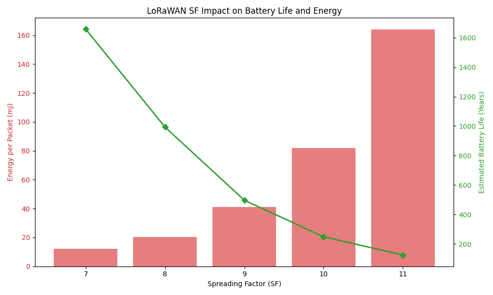
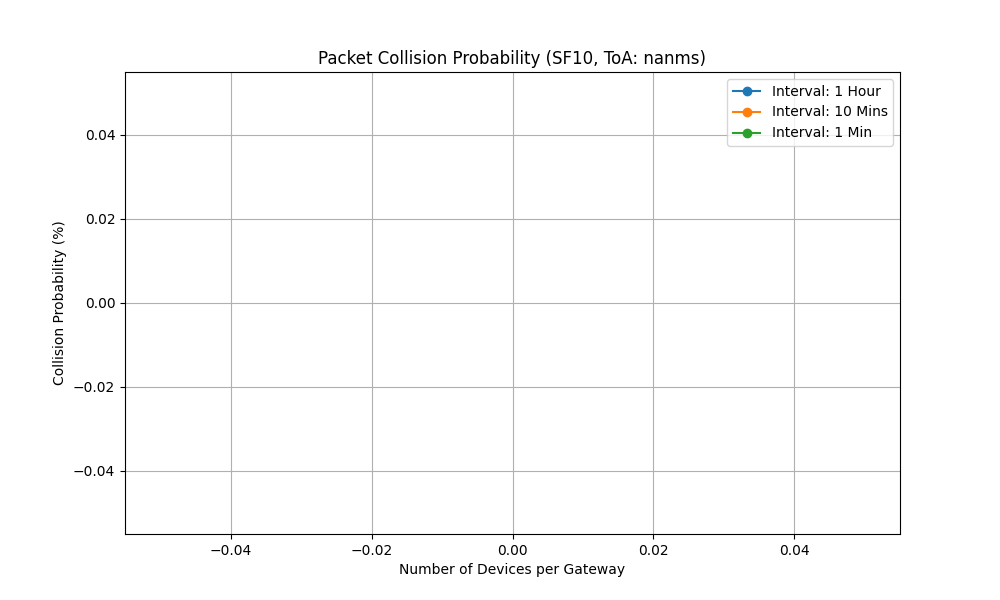

# LoRaWAN Spreading Factor (SF) Analizi: Akıllı Şehir Simülasyonu

Bu proje, LoRaWAN ağlarında **Spreading Factor (SF)** parametresinin ağ performansı, enerji tüketimi ve ağ kapasitesi üzerindeki etkilerini Python tabanlı bir simülasyon ile analiz eder.

Simülasyon, bir şehir merkezine dağılmış **akıllı çöp kutusu sensörleri** senaryosu üzerine kuruludur.

## 🚀 Proje Ne Yapıyor?

Proje, her bir sensörün gateway'e olan mesafesine göre dinamik bir SF ataması yapar ve şu analizleri gerçekleştirir:

1.  **Fiziksel Katman Analizi:** ToA (Time on Air) ve Bit Rate hesaplamaları.
2.  **Konum Analizi:** Cihazların koordinat bazlı SF dağılım haritası.
3.  **Enerji Analizi:** SF değerinin pil ömrü üzerindeki etkisi.
4.  **Ağ Kapasite Analizi:** Farklı trafik yoğunluklarında paket çakışma (collision) olasılığı.

## 📁 Klasör Yapısı

- `utils.py`: Matematiksel modeller ve LoRaWAN fiziksel katman formülleri.
- `simulation.py`: Sensör dağılımı, SF ataması ve senaryo yönetimi.
- `visualizer.py`: Elde edilen verilerin grafiklere dönüştürülmesi.
- `images/`: Üretilen tüm analiz grafiklerinin bulunduğu klasör.

## 📊 Analiz Sonuçları

### 1. Şehir Dağılım Map'i

Cihazların gateway etrafındaki halkalar (SF7-SF12) içindeki dağılımı:


### 2. Enerji ve Pil Ömrü

Uzak mesafedeki (SF12) cihazların enerji tüketimindeki dramatik artış ve pil ömrünün kısalması:


### 3. Paket Çakışma Olasılığı

Cihaz sayısı arttıkça ve iletim aralığı kısaldıkça ağ çakışma riskinin değişimi:


## 🛠 Kurulum ve Çalıştırma

Simülasyonu kendi makinenizde çalıştırmak için:

1. Bağımlılıkları kurun:

```bash
python3 -m venv venv
source venv/bin/activate
pip install numpy matplotlib
```

2. Simülasyonu başlatın:

```bash
python3 visualizer.py
```

Grafikler otomatik olarak `images/` klasörüne kaydedilecektir.

---

_Bu proje, LoRaWAN teknolojisini anlamak ve ağ planlama stratejileri geliştirmek için bir eğitim/simülasyon aracıdır._
