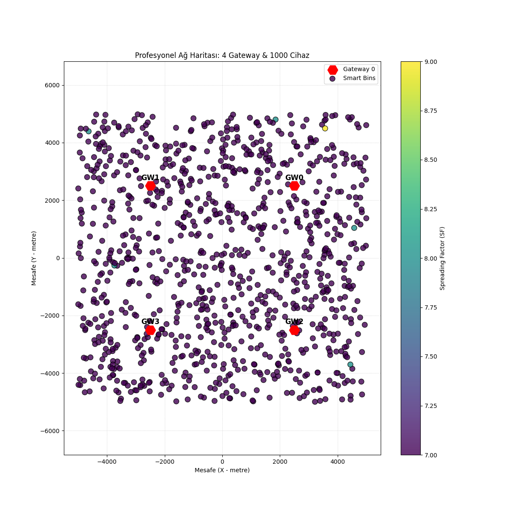
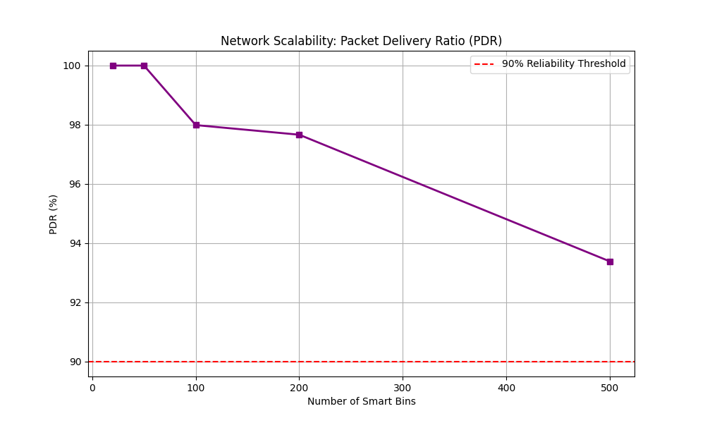

# 📡 LoRaWAN Spreading Factor & Network Capacity Simulator

Bu proje, LoRaWAN ağlarının fiziksel katman (PHY) ve MAC katmanı davranışlarını bir Akıllı Şehir senaryosu üzerinden simüle eden kapsamlı bir analiz aracıdır. Temel amacı, cihaz yoğunluğu arttıkça ağın kapasite sınırlarını, paket kayıp nedenlerini ve enerji verimliliğini bilimsel modellerle ortaya koymaktır.

## 🧐 Proje Ne Yapıyor?

Simülasyon, bir şehre dağıtılmış binlerce akıllı sensörün (örneğin akıllı çöp kutuları) ve onları dinleyen birden fazla Gateway'in (baz istasyonu) davranışlarını şu adımlarla taklit eder:

### 1. Akıllı Konumlandırma ve Radyo Modelleme

- **Şehir Planlama:** Belirlenen bir alanda (örneğin 10km²) sensörleri rastgele dağıtır.
- **Gerçekçi Sinyal Kaybı:** Sadece mesafe değil, şehir içindeki bina ve engelleri temsil eden **Log-Normal Shadowing** (gölgeleme) efektlerini kullanarak RSSI ve SNR değerlerini hesaplar.

### 2. Dinamik ADR (Adaptive Data Rate) Kontrolü

- Her cihaz, sinyal kalitesine (SNR) göre en verimli **Spreading Factor (SF7-SF12)** değerini seçer. Gateway'e yakın cihazlar SF7 ile yüksek hızda, uzak cihazlar SF12 ile yüksek hassasiyette iletişim kurar.

### 3. Zaman Tabanlı (Discrete Event) Trafik Simülasyonu

- Cihazlar saniye saniye takip edilir. Her cihazın ne zaman paket göndereceği, paketin havada kalma süresi (**Time on Air**) ve hangi frekansta olduğu hesaplanır.

### 4. Karmaşık Paket Kayıp Analizi

Proje, paketlerin neden ulaşmadığını iki ana nedene dayandırır:

- **Çakışmalar (Collisions):** Aynı anda, aynı kanal ve SF'de gelen paketlerin birbirini bozması (SIR - Sinyal Girişim Oranı bazlı).
- **Gateway Körlüğü (Blindness):** LoRaWAN gateway'leri genelde "Half-Duplex"tir. Bir gateway bir cihaza onay (ACK) gönderirken, o sırada gelen diğer hiçbir paketi duyamaz. Proje bu kritik kaybı detaylıca analiz eder.

### 5. Enerji ve Pil Ömrü Tahmini

- Her paket gönderiminde tüketilen mili-joule (mJ) cinsinden enerji hesaplanır ve cihazların pil ömürleri (yıl bazında) SF değerlerine göre raporlanır.

## 🌟 Öne Çıkan Özellikler

- **Gelişmiş Radyo Modeli:** Log-Distance Path Loss ve rastgele **Shadowing (6dB)** etkileri ile gerçekçi şehir ortamı.
- **Dinamik ADR (Adaptive Data Rate):** Cihazların sinyal kalitesine (SNR) göre en uygun SF7-SF12 değerini otomatik seçmesi.
- **Çoklu Gateway (Macro-Diversity):** Şehre dağıtılmış 4 kule üzerinden kapsama alanı analizi.
- **Frekans Atlamalı İletişim:** 8 farklı frekans kanalında trafik simülasyonu.
- **Downlink & Half-Duplex Analizi:** Gateway'lerin onay (ACK) gönderirken yaşadığı "körlük" (blindness) etkisinin modellenmesi.
- **İnteraktif Dashboard:** Tüm sonuçların statik görseller yerine modern bir HTML arayüzünde sunulması.

## 📂 Proje Yapısı

- `main.py`: Simülasyonu başlatan ana kontrol merkezi.
- `simulation.py`: Şehir mimarisi, cihaz yerleşimi ve ADR mantığı.
- `traffic_sim.py`: Zaman tabanlı paket trafiği ve çakışma (collision/blindness) motoru.
- `utils.py`: Matematiksel modeller (ToA, Path Loss, SIR, Energy).
- `visualizer.py`: Profesyonel grafik ve harita üretimi.
- `html/`: Modern, karanlık mod destekli interaktif analiz dashboard'u.
- `images/`: Üretilen tüm analiz sonuçlarının toplandığı görsel depo.

## 🚀 Hızlı Başlangıç

### 1. Simülasyonu Çalıştırın

Bu komut 1000 cihazlık profesyonel senaryoyu koşturur ve tüm grafikleri üretir:

```bash
python3 main.py
```

### 2. Dashboard'u Başlatın

Arayüzü görüntülemek için yerel sunucuyu açın:

```bash
python3 -m http.server 8000
```

Ardından tarayıcınızdan şu adrese gidin:
🔗 **[http://localhost:8000/html/index.html](http://localhost:8000/html/index.html)**

## 📊 Analiz Ekran Görüntüleri

### Çoklu Gateway ve SF Dağılımı



### Ağ Ölçeklenebilirliği ve Kayıp Analizi



## � Teknik Rapor

Simülasyonun bilimsel detayları, kullanılan formüller ve 2000 cihaza kadar yapılan stres testi sonuçları için `project_report.md` dosyasını inceleyebilirsiniz.

---

_Bu proje LoRaWAN ağlarının planlanması ve optimizasyonu için bilimsel bir temel sunar._
